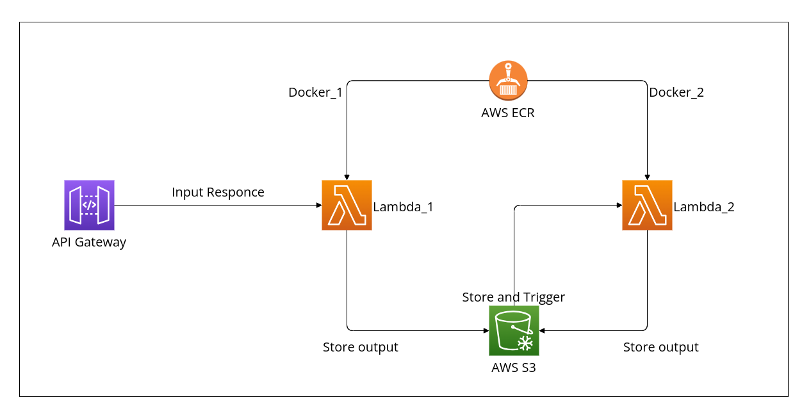

# Uplaoder_form AWS Infra

The Uplaoder_form project leverages AWS infrastructure to intake animal images from users, identifies the animal type and breed using the yolov8 model, and subsequently detects the pose of the animal's body and face. The system uses AWS Lambda for processing, AWS ECR for container storage, and AWS S3 for data storage.

## System Architecture

### Components:
- **API Gateway**:
    Accepts animal images in base64 format and provides a response structure: {"jobid": "str", "images": [{"image_data": "Base64_Image_str", "width": int,
            "height": int,
            "created_date": "str",
            "compression_quality": int,
            "file_name": "str"
        },
        {"image_data": "dcjwkwnc", "width": 500,
            "height": 500,
            "created_date": "2024-01-23 17:07",
            "compression_quality": 60,
            "file_name": "IMG_4841.jpeg"
        }
    ]
}.

- **Lambda_1 (Animal Type & Breed Detection)**:
    Triggered by API Gateway.
    Uses a Docker container from ECR with preinstalled dependencies and a YOLOv8 model.
    Outputs results as JSON in S3

- **Lambda_2 (Animal Pose Detection)**: 
    Triggered when new data is saved to the input_folder in S3.
    Uses a separate Docker container from ECR for pose detection.
    Outputs results as JSON in S3

- **ECR (Elastic Container Registry)**: 
    Stores the Docker images used by both lambdas.

- **S3 Bucket**:
    Stores the output of each Lambda function, organized by jobid.

## Workflow
- The user submits an image of an animal via the API Gateway get the responce of jobid and Images in Base64 format.

- The API Gateway triggers lambda_1, which is run inside a Docker container with pre-installed dependencies and a YOLOv8 model.

- lambda_1 processes the image to detect the animal's type and breed.

- The output of lambda_1 is saved as a .json file in the S3 bucket under: uploaderform-1/input/jobid_folder/generated_output.json

- The storage of this file in S3 triggers lambda_2, which also runs inside a Docker container. lambda_2 processes the file to detect the pose of the animal's body and face.

- The output of lambda_2 is saved as a .json file in the S3 bucket under: uploaderform-1/output/jobid_folder/generated_output.json

## Project Dependencies
- **Docker**: Used to containerize the Lambda functions and ensure consistent execution environments.

- **YOLOv8**: Deep learning model used for animal type and breed detection.

- **Other dependencies**: Essential libraries and tools utilized by the Lambda functions for image processing and JSON handling, such as Pandas and NumPy.